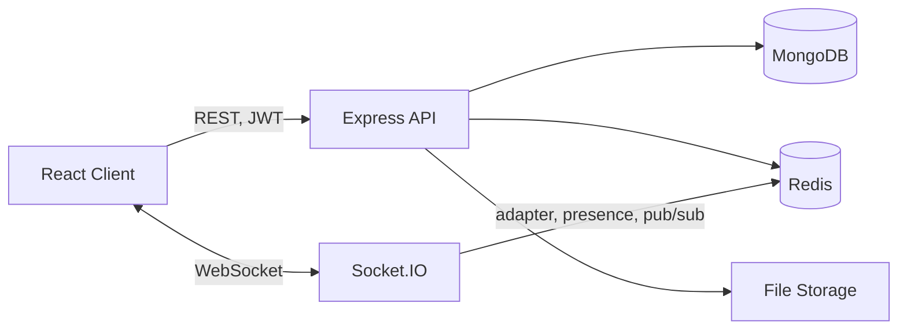
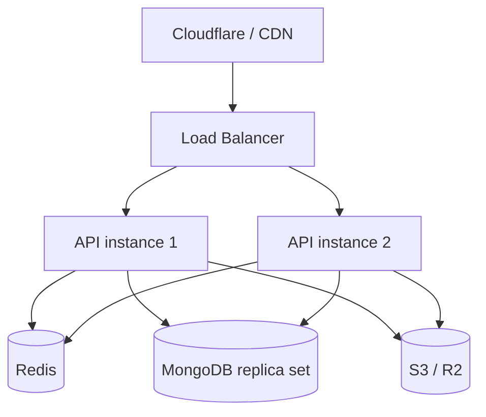

# Business Chat Platform

A production-oriented, real-time team chat application (Slack/Teams/WhatsApp-Business-style) built on the MERN stack + Socket.IO + Redis.

> **Status:** Backend (REST + Socket.IO + Mongo/Redis integration) is complete and type-checked. Frontend is in progress — see `PROGRESS.md` for exactly what's built vs. outstanding.

## Architecture



**Production scaling path** (no code changes required — see below):



Socket.IO is wired with `@socket.io/redis-adapter` from day one, so running `API1`/`API2` behind a load balancer "just works" — messages published by one instance are fanned out to sockets connected to the other via Redis pub/sub.

## Folder structure

```text
chat-platform/
├── apps/
│   ├── web/              React + TS + Vite frontend
│   └── api/               Express + TS backend
│       └── src/
│           ├── config/        env, db, redis, logger
│           ├── models/        Mongoose schemas
│           ├── repositories/  data access layer
│           ├── services/      business logic
│           ├── controllers/   HTTP request/response glue
│           ├── routes/        Express routers
│           ├── middleware/    auth, validation, error handling
│           ├── websocket/     Socket.IO auth, presence, typing, messaging
│           ├── validators/    Zod schemas
│           ├── utils/         JWT, password hashing, mappers, storage
│           ├── jobs/          seed script
│           └── __tests__/     Vitest + Supertest + socket.io-client tests
├── packages/
│   └── shared/             Types shared by web and api (DTOs, Socket.IO event contract, enums)
├── docker-compose.yml       Local MongoDB + Redis
└── .env.example
```

## Authentication architecture

- **Access token**: short-lived JWT (default 15m), sent as `Authorization: Bearer <token>`, held in memory on the client (never localStorage).
- **Refresh token**: long-lived JWT (default 30d), stored in an **httpOnly, secure, sameSite=lax** cookie scoped to `/api/auth`. The raw token is never persisted server-side — only a SHA-256 hash, alongside a `jti` claim used for O(1) lookup and revocation.
- **Rotation**: every `/api/auth/refresh` call issues a brand-new token pair and revokes the old one. If a revoked token is presented again (a strong signal of theft — reuse of a token that was already rotated away), the entire token family for that user is revoked, forcing re-login everywhere.
- Socket.IO connections authenticate the same access token via `socket.handshake.auth.token` in a connection-time middleware — the server never trusts a client-supplied user id, on REST or WebSocket.

## Real-time / presence architecture

- **Presence**: Redis holds a *set* of active socket ids per user (`presence:connections:{userId}`), not a boolean — so a user with multiple tabs/devices only goes "offline" once every connection has closed. A TTL on the set guards against a crashed process leaking a stuck "online" user. MongoDB stores the durable snapshot (`isOnline`, `lastSeenAt`), updated only on true online↔offline transitions, not on every socket connect.
- **Typing indicators**: purely ephemeral — broadcast over Socket.IO rooms, never written to MongoDB, with a server-side auto-stop timer as a safety net if a client disconnects mid-type.
- **Rooms**: one Socket.IO room per conversation (`conversation:{id}`); a user auto-joins every room for their conversations on connect.
- **Message delivery**: client sends `message:send` with a `clientTempId`; the server persists it, acks the sender (`message:ack`) to reconcile the optimistic local message, and broadcasts `message:new` to everyone else in the room. On failure, `message:failed` lets the client offer a retry.
- **Read receipts**: modeled as a single `lastReadAt` cursor per `(conversation, user)` — one write per "mark as read" event, not one write per message per user.

## File storage architecture

Uploads go through a `StorageProvider` interface (`utils/storage.ts`). The only implementation today is `LocalDiskStorageProvider`, writing to `UPLOAD_DIR` and serving via `/uploads`. Swapping in S3/R2/GCS/Azure later means implementing the same interface and changing one line where `storageProvider` is constructed — no caller (upload route, message service) needs to change.

## Running locally

### 1. Start MongoDB + Redis

```bash
docker compose up -d
```

### 2. Install dependencies

```bash
npm install
```

### 3. Configure environment

```bash
cp .env.example .env
# then edit JWT_ACCESS_SECRET / JWT_REFRESH_SECRET to real random values, e.g.:
openssl rand -hex 64
```

### 4. Seed demo data (optional but recommended)

```bash
npm run seed
```

This creates:

| Email | Password |
|---|---|
| admin@demo.com | Password123! |
| sarah@demo.com | Password123! |
| john@demo.com | Password123! |
| mike@demo.com | Password123! |

plus a direct conversation (Sarah ↔ John) and a group ("Engineering Team") with sample messages.

### 5. Run the app

```bash
npm run dev
```

- API: http://localhost:5000 (health check at `/health`)
- Web: http://localhost:5173

### Running tests

```bash
npm run test
```

Uses `mongodb-memory-server` to spin up a real (ephemeral) MongoDB for the test run — no Docker Mongo required for tests specifically, but it does need outbound network access the first time to download the MongoDB binary.

## Security notes

- Helmet, CORS (locked to `CLIENT_URL`), cookie-based CSRF-resistant refresh flow, rate limiting (global + a stricter limiter on `/api/auth/*`), Zod validation on every mutating endpoint, argon2id password hashing, upload MIME allow-listing (never trusts the client-reported type alone), and conversation-membership checks enforced in the service layer (not just the route) so both REST and WebSocket paths are covered by the same authorization logic.
- `passwordHash`, refresh tokens, and other secrets are never included in any API response, and are redacted from logs.

## What's implemented vs. outstanding

See `PROGRESS.md` for a living checklist.
